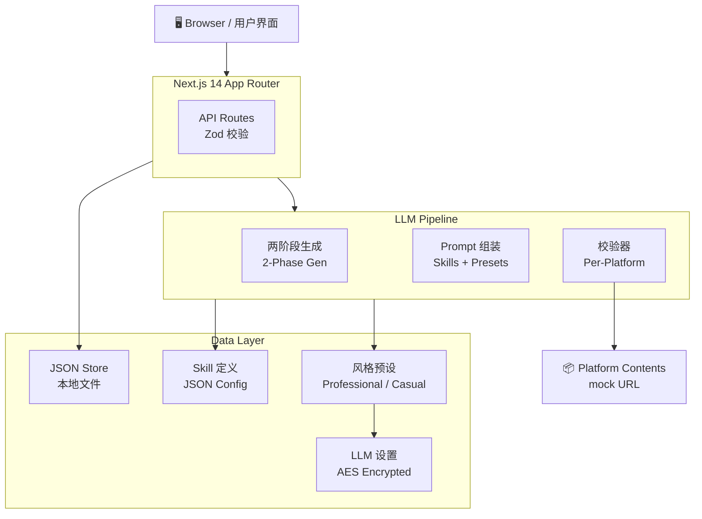

<div align="center">

<!-- HEADER -->
<table>
<tr><td align="center" bgcolor="#0f172a" style="border-radius:16px; padding:40px 60px;">

<h1 style="margin:0; font-size:42px; font-weight:900; background:linear-gradient(135deg, #38bdf8, #818cf8, #c084fc); -webkit-background-clip:text; -webkit-text-fill-color:transparent; background-clip:text;">OmniPost</h1>

<p style="margin:8px 0 20px 0; color:#64748b; font-size:16px;">多平台内容适配工作台 &nbsp;|&nbsp; Multi‑Platform Content Adaptation Workbench</p>

<table><tr>
  <td align="center" style="padding:6px 14px; background:#07C16020; border-radius:8px;"><b style="color:#07C160; font-size:18px;">微</b><br/><sub style="color:#64748b">公众号</sub></td>
  <td align="center" style="padding:6px 14px; background:#0066FF20; border-radius:8px;"><b style="color:#0066FF; font-size:18px;">知</b><br/><sub style="color:#64748b">知乎</sub></td>
  <td align="center" style="padding:6px 14px; background:#FF244220; border-radius:8px;"><b style="color:#FF2442; font-size:18px;">红</b><br/><sub style="color:#64748b">小红书</sub></td>
  <td align="center" style="padding:6px 14px; background:#FB729920; border-radius:8px;"><b style="color:#FB7299; font-size:18px;">B</b><br/><sub style="color:#64748b">B 站</sub></td>
</tr></table>

<p style="color:#94a3b8; font-size:13px; margin-top:18px;">✍️ Markdown 撰写 → 🤖 LLM 改写 → 📋 规则校验 → 🚀 模拟发布</p>

</td></tr>
</table>

<br/>

<!-- GITHUB SOCIAL BADGES -->
<p>
  
  
  
</p>

<!-- TECH STACK BADGES -->
<p>
  
  
  
  
  
  
</p>

<p>
  
  
  
  
</p>

</div>

---

<br/>

<!-- PLATFORM COLOR BAR -->
<div align="center">
  <table><tr>
    <td width="140" height="6" bgcolor="#07C160" style="border-radius:3px;"></td>
    <td width="140" height="6" bgcolor="#0066FF" style="border-radius:3px;"></td>
    <td width="140" height="6" bgcolor="#FF2442" style="border-radius:3px;"></td>
    <td width="140" height="6" bgcolor="#FB7299" style="border-radius:3px;"></td>
  </tr></table>
</div>

## ✨ 核心能力 &nbsp;/&nbsp; Core Capabilities

<table>
<tr>
<td width="50%">

### 🎨 一次创作，多端适配
在统一的 Markdown 编辑器中撰写原始内容，一键生成适配**微信公众号、知乎、小红书、B 站专栏**的差异化版本。每个平台拥有独立的编辑面板、预览视图和规则校验。

</td>
<td width="50%">

### 🎨 Write Once, Publish Everywhere
Draft in a unified Markdown editor, then generate platform-optimized versions for **WeChat, Zhihu, Xiaohongshu, and Bilibili** with one click. Each platform gets its own editing panel, preview, and rule validation.

</td>
</tr>
<tr>
<td width="50%">

### 🤖 LLM 驱动的内容改写
接入 OpenAI 兼容接口，通过**两阶段 pipeline**（内容摘要提取 → 平台适配生成）智能改写。每个平台拥有专属 Skill 定义，结合风格预设精准控制输出。

</td>
<td width="50%">

### 🤖 LLM-Powered Adaptation
Connects to any OpenAI-compatible API via a **two-phase pipeline** (content brief extraction → platform-specific generation). Each platform has a dedicated Skill definition paired with selectable style presets for precise output control.

</td>
</tr>
<tr>
<td width="50%">

### 📋 实时规则校验
每个平台版本提交前自动校验：**标题长度、摘要字数、标签数量、Emoji 使用、封面图建议**等。校验结果即时反馈，确保生成内容符合各平台规范。

</td>
<td width="50%">

### 📋 Real-Time Validation
Pre-submit validation for every platform version: **title length, summary word count, tag limits, emoji usage, cover image suggestions**. Instant feedback ensures content meets each platform's publishing standards.

</td>
</tr>
<tr>
<td width="50%">

### 🚀 模拟发布闭环
一键创建模拟发布任务，自动生成各平台的 mock 详情页。在**发布记录**中查看历史任务、访问链接、追溯发布状态，完整体验从创作到发布的工作流。

</td>
<td width="50%">

### 🚀 Simulated Publishing
One-click publishing creates mock tasks with accessible detail pages for each platform. Browse publish history, visit generated URLs, and trace task status — a complete content-to-publish workflow.

</td>
</tr>
</table>

<br/>

---

## 🧩 平台适配矩阵 &nbsp;/&nbsp; Platform Matrix

<table align="center">
<tr align="center">
  <td><b style="background:#07C16020; padding:6px 12px; border-radius:6px; color:#07C160;">微信公众号<br/>WeChat</b></td>
  <td><b style="background:#0066FF20; padding:6px 12px; border-radius:6px; color:#0066FF;">知乎<br/>Zhihu</b></td>
  <td><b style="background:#FF244220; padding:6px 12px; border-radius:6px; color:#FF2442;">小红书<br/>Xiaohongshu</b></td>
  <td><b style="background:#FB729920; padding:6px 12px; border-radius:6px; color:#FB7299;">B 站专栏<br/>Bilibili</b></td>
</tr>
<tr align="center">
  <td><sub>深度长文 · 排版精致</sub><br/><sub><i>Long-form · Polished layout</i></sub></td>
  <td><sub>专业问答 · 理性克制</sub><br/><sub><i>Expert Q&amp;A · Restrained tone</i></sub></td>
  <td><sub>轻量种草 · Emoji 友好</sub><br/><sub><i>Bite-sized · Emoji-rich</i></sub></td>
  <td><sub>社区活泼 · 标题党 OK</sub><br/><sub><i>Casual community · Clickbait OK</i></sub></td>
</tr>
<tr align="center">
  <td><code>title ≤ 64</code></td>
  <td><code>title ≤ 48</code></td>
  <td><code>title ≤ 20</code></td>
  <td><code>title ≤ 30</code></td>
</tr>
</table>

<br/>

---

## 🏗️ 架构总览 &nbsp;/&nbsp; Architecture

<div align="center">



</div>

<br/>

---

## 📦 项目结构 &nbsp;/&nbsp; Project Structure

```
src/
├── app/
│   ├── api/                         # Next.js Route Handlers
│   │   ├── contents/                #   原始内容 CRUD
│   │   ├── platform-contents/       #   平台版本读写
│   │   ├── publish/                 #   模拟发布 & 记录
│   │   └── settings/llm/            #   LLM 配置管理
│   ├── workspace/                   # 三栏工作台页面
│   ├── records/                     # 发布记录页面
│   └── mock/[platform]/[id]/        # 模拟发布详情页
├── components/
│   ├── workspace/                   #   工作台组件（三栏面板）
│   │   ├── WorkflowProvider.tsx     #     全局状态 Context + useReducer
│   │   ├── LeftPanel.tsx            #     原始内容输入
│   │   ├── CenterPanel.tsx          #     平台版本编辑 & 预览
│   │   └── PublishSettingsPanel.tsx #     发布配置
│   ├── preview/                     #   平台预览组件
│   │   ├── WechatPreview.tsx        #     公众号风格
│   │   ├── ZhihuPreview.tsx         #     知乎风格
│   │   ├── XiaohongshuPreview.tsx   #     小红书风格
│   │   └── BilibiliPreview.tsx      #     B站风格
│   └── ui/                          #   通用 UI 组件
├── lib/
│   ├── llm/                         #   LLM 生成 pipeline
│   │   ├── generate.ts              #     两阶段生成编排
│   │   └── settings-store.ts        #     API Key 加密存储
│   ├── prompts/builder.ts           #   Prompt 组装 (Skills + Presets)
│   ├── skills/*.json                #   各平台 Skill 定义
│   ├── presets/*.ts                 #   风格预设片段
│   ├── validators/*.ts              #   平台校验器
│   └── db/                          #   本地 JSON 数据层
├── types/index.ts                   # 全局类型定义
└── middleware.ts                    # 请求日志
```

<br/>

---

## 🚀 快速开始 &nbsp;/&nbsp; Quick Start

| Step | 中文 | English |
|---|---|---|
| **1. 安装依赖** | `npm install` | `npm install` |
| **2. 开发模式** | `npm run dev` → http://127.0.0.1:3000/workspace | `npm run dev` → http://127.0.0.1:3000/workspace |
| **3. 生产构建** | `npm run build && npm run start` | `npm run build && npm run start` |
| **4. 类型检查** | `npm run typecheck` | `npm run typecheck` |

> **环境要求 / Requirements**: Node.js ≥ 18.17（推荐 20 LTS）

---

## ⚙️ 环境变量 &nbsp;/&nbsp; Environment Variables

> 默认使用本地 mock 生成，无需配置即可体验。启用 LLM 需配置以下变量或通过 `/settings` 页面 UI 设置。  
> *Mock generation works out of the box. For real LLM generation, configure these variables or use the `/settings` UI.*

```bash
cp .env.example .env.local   # 复制示例文件 / Copy example
```

| 变量 / Variable | 说明 / Description | 默认值 / Default |
|---|---|---|
| `OMNIPOST_USE_LLM` | 启用 LLM 环境级兜底 / Enable LLM fallback | `false` |
| `OPENAI_API_KEY` | OpenAI 兼容 API 密钥 / API key | — |
| `OMNIPOST_OPENAI_BASE_URL` | API 地址 / Base URL | `https://api.openai.com/v1` |
| `OMNIPOST_OPENAI_MODEL` | 模型名称 / Model name | `gpt-4o-mini` |
| `OMNIPOST_ENCRYPTION_KEY` | UI 密钥加密密钥 / Encryption secret | 本地开发默认值 |
| `OMNIPOST_OAUTH_STATE_SECRET` | 平台 OAuth state 签名密钥 / OAuth state signing secret | 复用加密密钥 |
| `OMNIPOST_BILIBILI_CLIENT_ID` | B 站开放平台 Client ID / Bilibili OAuth client ID | — |
| `OMNIPOST_BILIBILI_CLIENT_SECRET` | B 站开放平台 Client Secret / Bilibili OAuth client secret | — |
| `OMNIPOST_BILIBILI_DEFAULT_CATEGORY` | B 站专栏默认分区 / Default Bilibili article category | `1` |
| `OMNIPOST_XIAOHONGSHU_APP_ID` | 小红书服务商 App ID / Xiaohongshu app ID | — |
| `OMNIPOST_XIAOHONGSHU_APP_SECRET` | 小红书服务商 App Secret / Xiaohongshu app secret | — |

> ⚡ **优先级 / Priority**: UI 保存的 Key > 环境变量 / Env Var > mock 回退  
> 🔐 **加密 / Encryption**: UI 配置的 API Key 经 AES-256-GCM 加密后落盘 / *API keys encrypted at rest via AES-256-GCM*

---

## 🔌 API 速查 &nbsp;/&nbsp; API Reference

| Method | Route | 说明 / Description |
|---|---|---|
| `POST` | `/api/contents` | 创建原始内容 / Create content |
| `POST` | `/api/contents/:id/generate` | 生成平台适配 / Generate adaptations |
| `GET` `PUT` | `/api/platform-contents/:id` | 读写平台版本 / Read/update platform version |
| `GET` `PUT` `DELETE` | `/api/settings/llm` | LLM 配置管理 / LLM config CRUD |
| `POST` | `/api/settings/llm/test` | 测试 LLM 连接 / Test connection |
| `GET` | `/api/accounts` | 查询平台账号连接状态 / List platform account connections |
| `POST` | `/api/accounts/:platform/connect` | 发起 OAuth 连接 / Start OAuth connection |
| `GET` | `/api/accounts/:platform/callback` | OAuth 回调落库 / OAuth callback |
| `GET` | `/api/publish/capabilities` | 查询真实/辅助发布能力 / Publish capability matrix |
| `POST` | `/api/publish/preflight` | 发布前能力检查 / Publish preflight |
| `POST` | `/api/publish/submit` | 统一发布入口 / Submit real, assist, or mock publish |
| `POST` | `/api/publish/mock` | 创建模拟发布 / Mock publish |
| `GET` | `/api/publish/tasks` | 查询发布记录 / List publish tasks |

真实发布连接规则：微信公众号使用设置页 AppID/AppSecret；知乎、小红书、B 站在没有开放平台资质时以辅助发布包承接，可在生成的详情页一键复制到对应平台后台。B 站如果后续拿到开放平台 OAuth 和 `ATC_BASE` 专栏权限，可再切换为真实发布。

---

## 🗺️ 路线图 &nbsp;/&nbsp; Roadmap

| Version | Status | 内容 / Features |
|---|---|---|
| `v1.0` | ✅ | 三栏工作台 · 4 平台适配 · LLM/Mock 双模式 · 规则校验 · 模拟发布 |
| `v1.1` | 🏗️ | SQLite 持久化 · 图片上传与管理 · 批量发布 |
| `v1.2` | 📋 | 更多平台支持 · 自定义 Style Preset · 真实平台 API 发布 |
| `v2.0` | 💡 | 协作编辑 · 版本历史 · 内容分析仪表盘 |

<br/>

---

<div align="center">

| | | |
|---|---|---|
| **OmniPost** | 多平台内容适配工作台 | Multi‑Platform Content Adaptation Workbench |
| **Stack** | Next.js · React · TypeScript · Tailwind CSS · Zod · Drizzle ORM |
| **License** | MIT |

<br/>
<sub>Made with ❤️ for content creators</sub>

</div>
